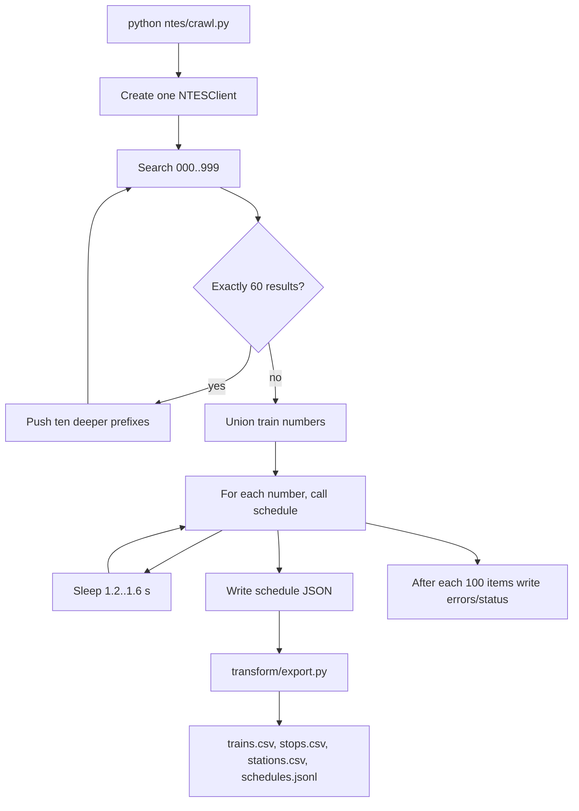
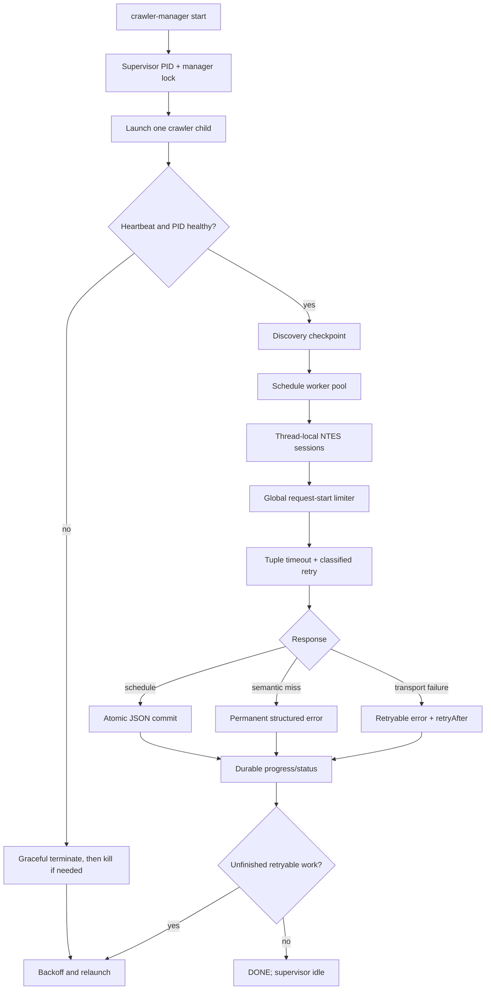

# railpull crawler analysis and optimization report

Date: 2026-09-06

## Scope and evidence

The repository is a small Python/Node toolkit with no committed crawl output
and no database. The timetable crawler is `ntes/crawl.py`; the delay poller is a
separate live-data job; `transform/export.py` converts raw schedule files; and
`osm/` contains optional, offline-heavy OpenStreetMap jobs. The dependency
`ntes-client==0.1.3` was inspected as well as the repository source. A live
NTES benchmark was not run because that would add unnecessary load to a public
service, so timing improvements below are estimates based on the request loop
and should be validated on the next controlled crawl.

The client uses one encrypted HTTP POST endpoint for search, schedule, and
station-board operations. Its public documentation describes a reusable
`requests.Session`, configurable timeout/retries, and explicitly labels
parallel requests as something to use with caution. The crawler now sets the
library retry count to zero and owns the retry policy so semantic and transport
failures are not conflated.

## Existing architecture and execution flow

The original entry point was `python ntes/crawl.py`. It created one
`NTESClient`, swept the adaptive prefix tree, then fetched one schedule at a
time. Each successful schedule became `data/raw/schedules/<number>.json`.
`transform/export.py` later scanned those files and emitted CSV/JSONL tables.
The delay poller and OSM tools are independent entry points.

| Component | Entry point | Work performed | Main resource profile |
|---|---|---|---|
| Timetable crawl | `python ntes/crawl.py` | Adaptive prefix discovery, then one schedule response per train | Network-bound; original version was fully serial and file-write-bound at checkpoints |
| Delay poller | `python ntes/poll_delays.py` | Serial sweep of the bundled top-station list, then merge nearest sightings | Network-bound, intentionally separate from timetable crawl |
| Export | `python transform/export.py` | Parse raw JSON, derive running weekdays, flatten trains/stops/stations/JSONL | CPU and sequential local I/O; normally minutes or less after a crawl |
| Station geocoder | `node osm/geocode_stations.mjs extract.osm.pbf` | Stream OSM nodes, match station code/name, rewrite station CSV | One large sequential OSM read; memory grows with OSM station indexes |
| Track router | `node osm/route_tracks.mjs extract.osm.pbf` | Build rail graph, snap stations, run Dijkstra per unique stop pair | Highest CPU/RAM job; offline and not on the timetable critical path |
| Seed data | `ntes/major_stations.json` | Ordered station codes for delay polling | Small static JSON read |

There is no database layer: the durable store is a directory of per-train JSON
files plus small JSON checkpoint maps. The client handles encryption/decryption
and JSON decoding before crawler code sees dictionaries. The exporter then
parses each schedule, folds `vStartDateList` into weekday names, and writes
flat rows. The optional OSM scripts have their own CSV parsers and do not call
NTES.



The original resume state was split across `numbers.json`, `errors.json`, and
the schedule directory. Existing schedule files were treated as complete by
filename alone.

## Bottleneck analysis

### 1. Serial schedule requests dominate wall time

The schedule stage performs approximately one request per discovered train
(the README estimates about 12,000 numbers). The original loop waits for the
request to finish and then sleeps. If average request latency is `L`, its
approximate time is:

```text
N * (L + 1.2..1.6 seconds)
```

For 12,000 trains, the pacing floor alone is about 4.7 hours at the average
1.4-second pause. With 0.8 seconds average network latency, the old loop is
about 7.3 hours before retries and failures. This is the largest avoidable
cost.

The `time.sleep` itself is a deliberate politeness control, not an accidental
busy-loop delay. The avoidable part was placing it after a blocking request in
the same worker. The old status path also rescanned the entire schedule
directory every 100 items; that is small beside network time, but it was
removed from the hot path by maintaining progress counters.

### 2. The claimed read timeout was not actually applied

The old code partially bound `Session.request(timeout=(10, 30))`, but
`ntes-client` subsequently passed its own scalar `timeout` keyword from
`NTESClient.timeout`. The later keyword value wins, so the read side was still
the library's scalar timeout. A silent socket could therefore occupy the only
worker much longer than intended.

### 3. Transport and semantic errors were mixed

`ntes-client` raises `NTESError` for both server-declared semantic failures and
wrapped transport failures. Its internal loop also retries every `NTESError`
without a delay. The outer crawler then interpreted every `NTESError` as a
semantic “no result”, while generic exceptions were retried. Consequences:

* temporary network failures were recorded as permanent schedule omissions;
* semantic misses consumed unnecessary internal attempts;
* the crawler stopped after a global failure counter rather than preserving a
  useful retry queue.

### 4. Discovery checkpoints could lose the adaptive queue

Only completed prefixes were persisted. If a full prefix had already been
marked done and its ten deeper prefixes were still in memory when the process
crashed, the next run rebuilt only the original three-digit list. Those deeper
prefixes could be skipped permanently. The new checkpoint persists `pending`,
`done`, counters, and prefix retry records.

### 5. Direct writes could create false completion

Status, roster, error, and schedule JSON files were written directly. A crash
during a write could leave malformed JSON. More seriously, a partially written
schedule still existed by filename and would be skipped on the next run; the
exporter silently ignored malformed JSON. New writes use a temporary file,
`fsync`, and `os.replace`, and schedule discovery validates the JSON structure.

### 6. Failures were skipped forever

The original `errors.json` was a number-to-string map and every number in it
was excluded from future runs. There was no distinction between a discontinued
train, a timeout, a temporary outage, and a process crash. The new map records
kind, message, request attempts, total attempts, last attempt, and retry time.

### 7. There was no ownership or watchdog layer

The original crawler could be started twice. Concurrent processes could race on
the same roster/error files and duplicate requests. A shell/session exit left
the crawl stopped, with no PID, health, restart, or shutdown protocol. The new
manager owns a process lock, forwards graceful shutdown, checks heartbeats,
rotates logs at manager startup, and resumes after restarts.

### 8. Secondary paths

* `transform/export.py` is CPU/light-I/O work compared with the network crawl,
  but its original output files could be left half-written. It now builds all
  four outputs in temporary files and publishes them after successful export.
* `ntes/poll_delays.py` was also serial and had the same ineffective timeout
  patch. It now uses the real tuple timeout, disables hidden client retries,
  adds classified retries, and atomically publishes its snapshot. It remains a
  separate job and is not run by the timetable watchdog.
* The OSM route step is intentionally separate. Its graph construction and
  repeated Dijkstra searches are CPU/memory-heavy, but they do not contribute to
  timetable crawl time. It already caches station snaps and de-duplicates
  station pairs.

## Implemented design



### Performance changes

1. Schedule requests run in a bounded `ThreadPoolExecutor` (default four
   workers). Each worker lazily gets its own `NTESClient` and `requests.Session`,
   avoiding unsafe cross-thread session sharing.
   Only roughly `2 * workers` futures are in flight; the remaining roster stays
   as a lightweight iterator rather than becoming thousands of queued future
   objects.
2. A single lock-protected limiter paces all request starts, including retries.
   The default remains at least 1.2 seconds plus jitter between starts, which is
   approximately 50 starts/minute and retains the repository's polite behavior.
   Concurrency overlaps network wait with other work; it does not create a
   request burst.
3. The client is configured with `timeout=(connect, read)` and `retries=0`.
   The crawler applies bounded exponential backoff only to likely transport or
   temporary failures.
4. HTTP adapters are mounted per session with reusable connections and a
   bounded pool.
5. Discovery remains sequential because it is an adaptive prefix tree. This
   avoids complex frontier races and keeps the public endpoint load predictable;
   the schedule stage is the meaningful parallel workload.

### Reliability changes

1. Every schedule commit is atomic and validated on resume.
2. `numbers.json` stores both `done` and `pending` discovery prefixes, so a
   crash cannot discard newly generated child prefixes.
3. Retryable failures are persisted with a backoff timestamp. Semantic misses
   remain visible but do not cause endless re-fetching. `--retry-errors` can
   explicitly retry them.
4. A shared endpoint circuit opens after 12 transport failures, causing a
   bounded exit instead of spending hours on a dead service. The manager then
   waits and restarts with exponential backoff.
5. A heartbeat updates the status document while work is in progress. The
   manager restarts a live process whose heartbeat is stale for the configured
   hang timeout.
6. POSIX file locks prevent duplicate crawler and manager instances.
7. SIGINT/SIGTERM set a stop event, preserve checkpoints, and release locks.

## Expected performance

The exact result depends on NTES latency and response failure rate. The new
global pacing intentionally keeps the same request-start ceiling, so the safe
gain is the removal of idle time while a previous request is waiting on the
network:

| Average request latency | Original schedule stage | New paced lower bound | Estimated wall-time reduction |
|---:|---:|---:|---:|
| 0.5 s | ~6.3 h | ~4.7 h | ~26% |
| 0.8 s | ~7.3 h | ~4.7 h | ~36% |
| 2.0 s | ~11.3 h | ~4.7 h | ~59% |

These are illustrative 12,000-train calculations using a 1.4-second average
old pause and exclude retries, discovery, and server throttling. In practice,
the new schedule is bounded by `max(N * paced_interval, N * latency / workers)`;
the table assumes latency does not exceed the four-worker capacity. If the
server responds faster than the pacing interval, concurrency will not reduce
the request-rate floor. The biggest practical improvement in that case is
automatic recovery and avoiding a full restart.

## Risks and tradeoffs

| Change | Benefit | Tradeoff / control |
|---|---|---|
| Four schedule workers | Hides network latency | More simultaneous sockets; all starts still pass through one conservative limiter. Tune `RAILPULL_WORKERS`. |
| Outer retries | Recovers transient failures | Read-only POSTs may be repeated; exponential backoff and a circuit breaker bound this. |
| Per-worker sessions | Connection reuse without shared-session races | A few extra idle sockets and small memory overhead. |
| Atomic files | No false-complete partial records | Temporary disk space and `fsync` cost per committed schedule. |
| Automatic restart | No manual restart after common failures | A persistent outage can produce repeated attempts; restart backoff and optional `RAILPULL_MAX_RESTARTS` limit it. |
| Heartbeat hang detection | Recovers deadlocks/silent sockets | An overly small timeout could kill a legitimately slow run; default is 15 minutes and the crawler heartbeat is independent of item completion. |
| Permanent semantic errors | Avoids retrying discontinued numbers forever | A transient semantic-looking response needs `--retry-errors` or an edited error record. |

## Status and operations

The manager stores runtime files under `data/runtime/` and reads the crawler's
structured status at `data/raw/crawl-status.json`. Use:

```bash
./crawler-manager start
./crawler-manager status
./crawler-manager progress
./crawler-manager logs
./crawler-manager logs --no-follow --lines 200
./crawler-manager stop
./crawler-manager restart
```

For reboot persistence, run `deploy/railpull-crawler.service` after replacing
the example paths with the checkout and virtual-environment paths, then enable
it with systemd. The service runs the manager in foreground mode and asks
systemd to restart the manager only if the manager itself fails.

## Validation performed

* Python bytecode compilation succeeds for the crawler, manager, and exporter.
* The manager help/status commands run without the NTES dependency installed.
* A fake-client test exercised concurrent schedule fetching, atomic files,
  semantic error persistence, no duplicate re-fetch of completed/error items,
  and completion of the persisted discovery frontier.
* No live endpoint benchmark was run.
